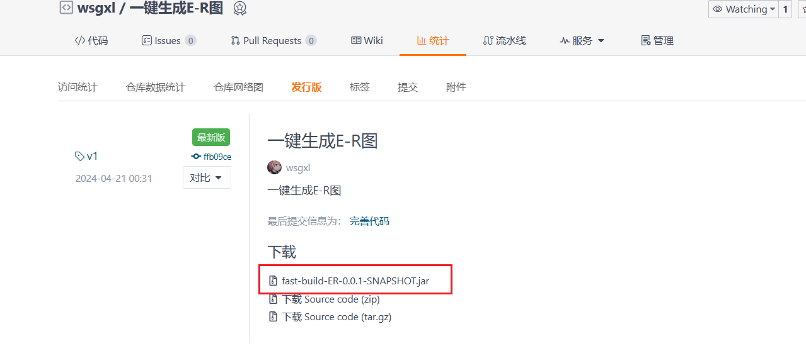

# 从Mysql数据库一键生成ER图,论文、报告、PPT、需求、后端开发 必备工具
|环境| 要求  |
|----------------------------------|---|
| 适用系统 |  win8、10、11系统  |
|JDK版本| 大于等于1.8  |
|Mysql版本| 大于等于8.0  |

## 使用方法 
### 1 发行版下载、直接控制台/终端运行
#### 发行版下载!
https://gitee.com/wsgxl/fast-build-ER/releases

#### 打开终端运行

### 2 输入相关信息

### 3 查看效果

## 定制方法：
### 1 下载代码
### 2 修改这些信息即可

### 3 详细修改,请阅读代码

有用的期待您的赞赏 :bowtie:  :bowtie: 
打赏码:

